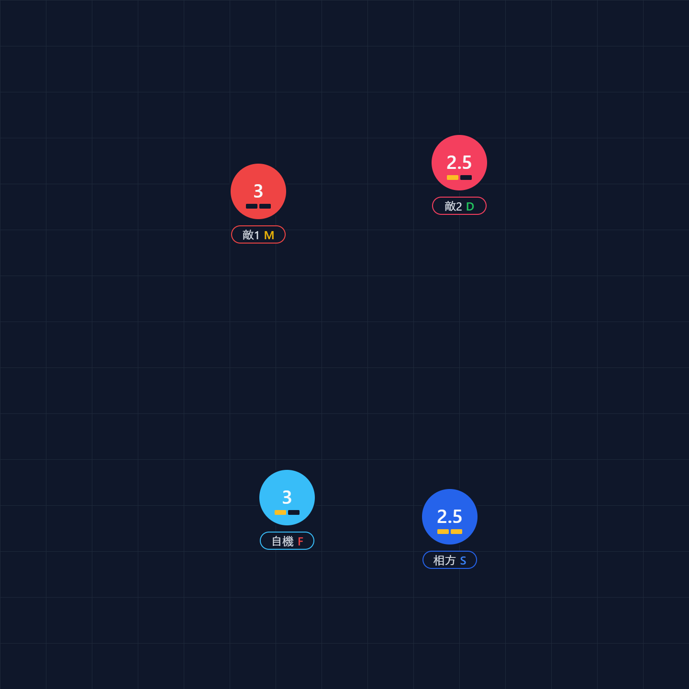

# 星の翼 (Starward Tactics) 戦術ボード

ブラウザだけで動く、2 vs 2 チームの編成・戦術検討ツール。

## このツールについて

星の翼 (Starward Tactics) のような 2 vs 2 のチーム制対戦アクションを想定した、
盤面エディタ + 編成シェアラーです。**自機 / 相方 / 敵 1 / 敵 2** の 4 機を
盤面にドラッグして並べ、コスト・覚醒・コア種別を決め、出来上がった盤面を
URL ごと友達に投げて議論する、というのが基本の使い方。

サーバーは持たず、状態は全部 URL クエリ (`?b=...`) に詰めて共有するので、
**インストール不要・ログイン不要・ブラウザを開けば動く**。

## スクリーンショット



## 使い方

1. ブラウザで開く (公開先未設定なら `npm run dev` でローカル起動)
2. 4 機を盤面にドラッグして配置する。クリックで選択、ドラッグで移動
3. 右側の Inspector で選択中のユニットを編集する
   - **コスト**: 1.5 / 2 / 2.5 / 3
   - **覚醒**: なし / 半覚 / 全覚
   - **コア**: F (格闘) / S (射撃) / M (機動) / D (防御) / B (バランス) / C (カバーリング)
   - **ロック対象**: 相方 / 敵 1 / 敵 2 / なし
4. ヘッダーの **Undo / Redo / Reset** で履歴を行き来したり初期状態に戻したりできる
5. ブラウザのアドレスバーに表示されている URL がそのまま盤面状態。
   コピーして共有すれば、相手はそのリンクを開くだけで同じ盤面を再現できる

## 開発セットアップ

```sh
npm install
npm run dev
```

開発サーバーは `http://localhost:5173/` で起動する。

## ビルド・テスト

| 用途 | コマンド |
|---|---|
| プロダクションビルド | `npm run build` |
| ユニットテスト | `npm run test` |
| 型チェック | `npm run typecheck` |
| Lint | `npm run lint` |
| ビルド成果物のプレビュー | `npm run preview` |

`npm run lint && npm run typecheck && npm run test && npm run build` の
4 点セットを「push 前に必ず通す品質ゲート」としている。

## 技術スタック

React 19 / TypeScript / Vite / Tailwind CSS v4 / Vitest

- 状態管理は `useReducer` ベース。Context は責務ごとに 4 つに分割し、無関係な
  再 render を抑制している (詳細は `src/state/BoardContext.ts` 冒頭コメント参照)
- 盤面描画は SVG。色は属性値 (`fill` / `stroke`) で持ち、Tailwind class に
  依存しない (将来の PNG 出力を単純化するため)

## ロードマップ

Phase 1 〜 6 で「盤面 + 編成編集 + URL 共有 + Undo/Redo + ドラッグ&ドロップ」
までが揃った段階。これ以降のフェーズ (方向ピッカー / ロック線描画 / PNG 出力 /
レイアウト仕上げなど) は GitHub Issues で管理している。

```sh
gh issue list
```

## コントリビュート

個人プロジェクトなので外部 PR を能動的には募集していないものの、**実装ルール
(コミット規約・テスト方針・コード規約・Credo 4 原則) は `CLAUDE.md` と
`.claude/rules/` に集約されている**。手元で改造して試す場合の参考にどうぞ。

## ライセンス

現状 `LICENSE` ファイル未設定。OSS として外部に公開する際は MIT を入れる予定。

---

### CLAUDE.md との関係 (責務分離)

このリポジトリには README.md と CLAUDE.md という 2 つの「索引ファイル」があり、
**読者を明確に分けている**:

| ファイル | 対象読者 | 役割 |
|---|---|---|
| `README.md` (このファイル) | 人間 (訪問者・コントリビューター・将来の自分) | プロジェクト紹介・スクショ・使い方 |
| `CLAUDE.md` | エージェント (Claude / Gemini / Codex) | 必須コマンド・禁止事項・運用ルール索引 |
| `.claude/rules/*.md` | エージェント (CLAUDE.md からのポインタ先) | コード規約・Git ワークフロー・テスト方針などの詳細 |

開発者向けの AI 運用ルールは `CLAUDE.md` を起点に辿ってください。
